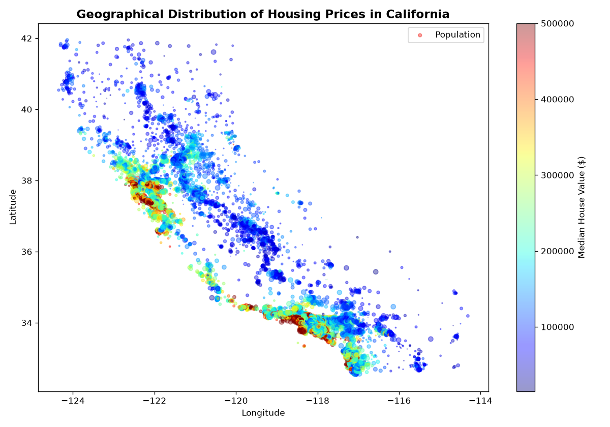
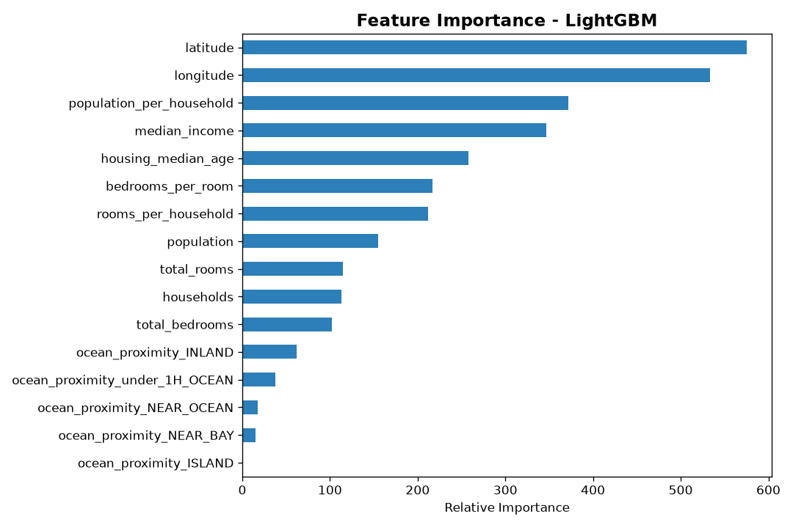
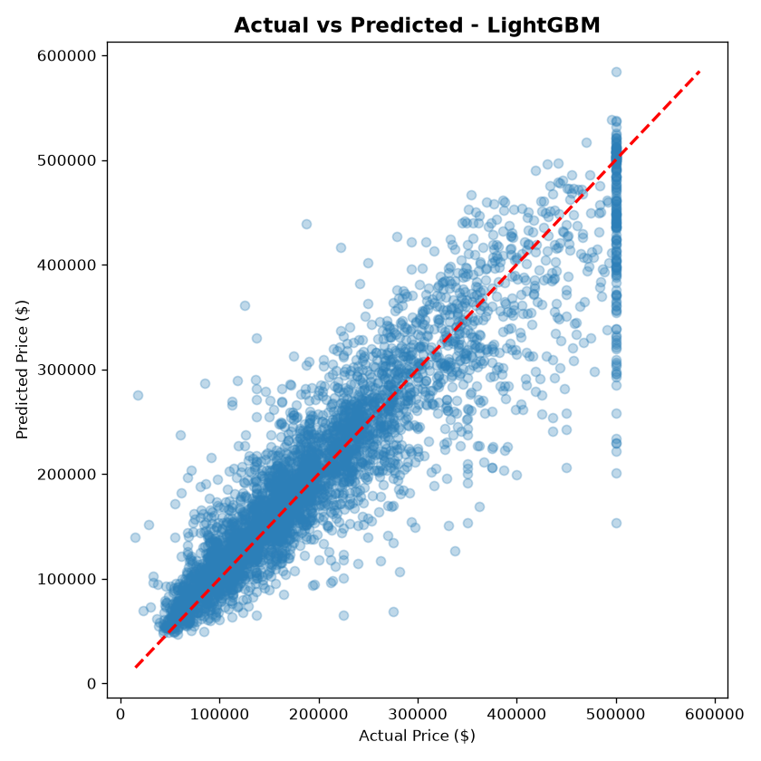
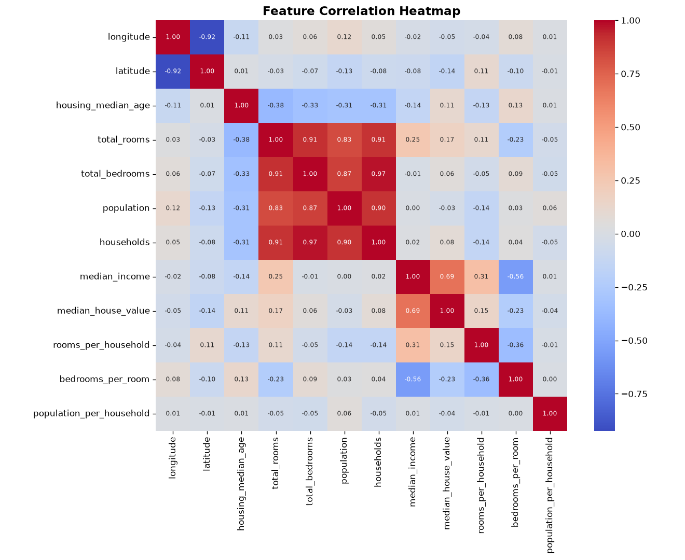
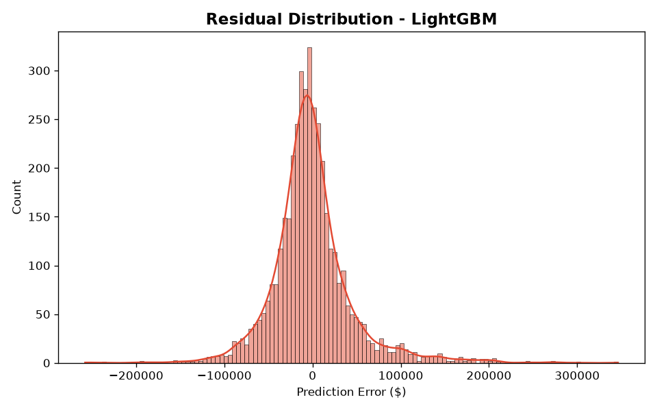
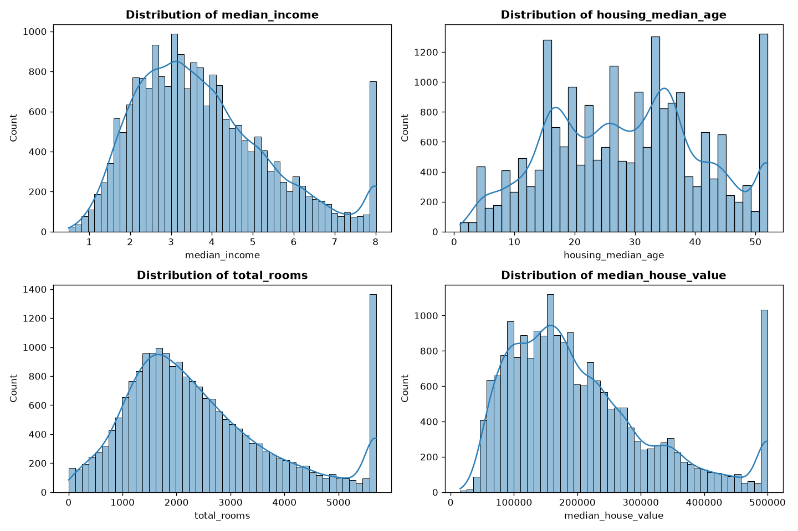

# 🏠 AI California House Price Prediction System

A production-grade Machine Learning system for predicting California housing prices based on 1990 U.S. Census data. Built with a clean modular architecture, Optuna hyperparameter optimization, unit test coverage, and an interactive Streamlit web dashboard.


---

## 📌 Executive Summary

This repository delivers an end-to-end regression system capable of estimating median house values in California block groups. It includes missing value imputation, IQR winsorizing for outlier treatment, ratio feature engineering, one-hot categorical encoding, standard feature scaling, multi-model candidate evaluation (Linear Regression, Ridge, Lasso, Random Forest, Gradient Boosting, XGBoost, LightGBM), Optuna cross-validation hyperparameter tuning, automated model selection, and an interactive Streamlit web application.

### 🏆 Live Model Leaderboard Results

| Model | MAE ($) | MSE | RMSE ($) | R² | Adjusted R² | MAPE (%) | 5-Fold CV R² |
| :--- | :---: | :---: | :---: | :---: | :---: | :---: | :---: |
| **LightGBM (Best)** | **$30,807.56** | **2.14e+09** | **$46,229.03** | **0.8369** | **0.8363** | **17.43%** | **0.8359** |
| XGBoost | $30,705.21 | 2.19e+09 | $46,744.36 | 0.8333 | 0.8326 | 17.42% | 0.8345 |
| GradientBoosting | $35,368.08 | 2.72e+09 | $52,163.50 | 0.7924 | 0.7915 | 20.12% | 0.8079 |
| RandomForest | $36,306.18 | 2.98e+09 | $54,622.75 | 0.7723 | 0.7714 | 20.59% | 0.7853 |
| Ridge | $51,680.56 | 5.33e+09 | $73,038.71 | 0.5929 | 0.5913 | 30.88% | 0.6762 |
| LinearRegression | $51,682.21 | 5.33e+09 | $73,039.25 | 0.5929 | 0.5913 | 30.89% | 0.6762 |
| Lasso | $51,682.21 | 5.33e+09 | $73,039.26 | 0.5929 | 0.5913 | 30.89% | 0.6762 |

*The top performing model (LightGBM) is automatically serialized to `models/best_model.pkl` along with preprocessor scalers and feature mappings.*

---

## 📁 Repository Architecture

```
House-Price-Prediction/
├── app/
│   └── streamlit_app.py        # Interactive Streamlit web application
├── data/
│   ├── raw/                   # Auto-downloaded raw California Housing CSV
│   └── processed/             # Cleaned & preprocessed datasets
├── images/                    # Generated high-resolution charts & visualizations
│   ├── actual_vs_predicted.png
│   ├── correlation_heatmap.png
│   ├── feature_distributions.png
│   ├── feature_importance.png
│   ├── geographical_distribution.png
│   └── residual_distribution.png
├── models/                    # Serialized best model, scaler, and column order
├── notebooks/
│   ├── EDA.ipynb               # Exploratory Data Analysis notebook
│   ├── Feature_Engineering.ipynb # Feature engineering & preprocessing exploration
│   └── Model_Training.ipynb    # Model training, Optuna tuning, and evaluation
├── reports/
│   └── leaderboard.csv         # Exported model comparison leaderboard
├── src/
│   ├── data_loader.py          # Data ingestion and local caching
│   ├── preprocessing.py        # Missing value imputation, capping, train/test split
│   ├── feature_engineering.py  # Derived features, encoding, feature scaling
│   ├── evaluate.py             # Evaluation metrics (MAE, MSE, RMSE, R2, MAPE)
│   ├── train.py                # Hyperparameter tuning, CV, training, chart generation
│   ├── predict.py              # Single/batch prediction interface
│   └── utils.py                # Logger, seed setting, joblib object persistence
├── tests/                     # Comprehensive pytest unit test suite
│   ├── test_data_loader.py
│   ├── test_evaluate.py
│   ├── test_feature_engineering.py
│   ├── test_predict.py
│   ├── test_preprocessing.py
│   └── test_utils.py
├── .gitignore
├── LICENSE
├── README.md
└── requirements.txt
```

---

## 📊 Dataset Description

The dataset consists of **20,640 records** from the 1990 California U.S. Census ([Pace & Barry, 1997](https://www.dcc.fc.up.pt/~ltorgo/Regression/cal_housing.html)). Each record represents a census block group:

- `longitude` & `latitude`: Geographical location coordinates.
- `housing_median_age`: Median age of houses in block.
- `total_rooms` & `total_bedrooms`: Aggregate count of rooms/bedrooms.
- `population`: Total population in block group.
- `households`: Total number of households.
- `median_income`: Median income in tens of thousands of USD.
- `ocean_proximity`: Categorical location relative to ocean (`<1H OCEAN`, `INLAND`, `NEAR OCEAN`, `NEAR BAY`, `ISLAND`).
- **Target**: `median_house_value` in USD.

### Engineered Features
- `rooms_per_household` = `total_rooms` / `households`
- `bedrooms_per_room` = `total_bedrooms` / `total_rooms`
- `population_per_household` = `population` / `households`

---

## 🖼️ System Visualizations

| Geographical Price Distribution | Feature Importance | Actual vs Predicted |
| :---: | :---: | :---: |
|  |  |  |

| Correlation Heatmap | Residual Distribution | Feature Distributions |
| :---: | :---: | :---: |
|  |  |  |

---

## 🛠️ Quickstart & Usage

### 1. Installation

Clone the repository and install dependencies:
```bash
git clone https://github.com/<your-username>/House-Price-Prediction.git
cd House-Price-Prediction
pip install -r requirements.txt
```

### 2. Train Models & Tune Hyperparameters

Execute the end-to-end pipeline to download data, clean features, run Optuna hyperparameter tuning, evaluate candidate algorithms, export performance metrics, and generate chart artifacts:
```bash
python src/train.py
```

### 3. Programmatic Predictions

Generate price predictions programmatically in Python:
```python
from src.predict import predict_price

sample_house = {
    "longitude": -118.25,
    "latitude": 34.05,
    "housing_median_age": 25,
    "total_rooms": 3000,
    "total_bedrooms": 600,
    "population": 1400,
    "households": 550,
    "median_income": 5.5,
    "ocean_proximity": "NEAR OCEAN"
}

price = predict_price(sample_house)
print(f"Estimated Median House Value: ${price:,.2f}")
```

### 4. Launch Interactive Web App

Run the Streamlit application locally:
```bash
streamlit run app/streamlit_app.py
```

---

## 🧪 Unit Testing

Run the full pytest test suite to verify module behavior and system integrity:
```bash
python -m pytest tests/
```

Unit tests cover data loading, median imputation, outlier capping, feature engineering, evaluation metrics, seed setting, artifact serialization, missing model error handling, and prediction inference.

---

## 📄 License

Distributed under the MIT License. See [LICENSE](LICENSE) for more details.
